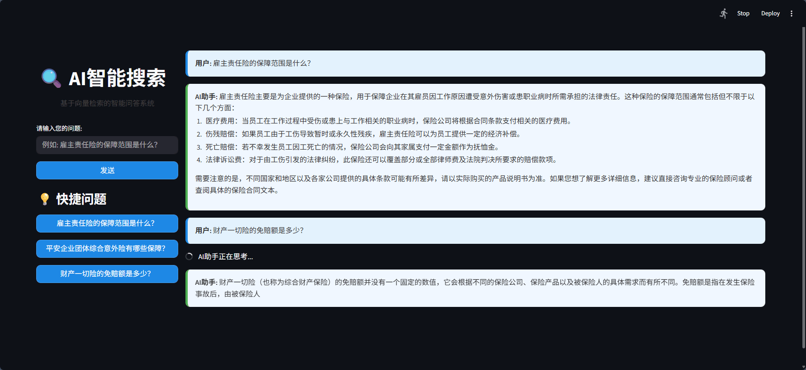

# AnyQ (Any Question) - 智能文档问答系统



## 功能特性
- 基于向量检索的智能问答系统
- Elasticsearch 9.1.4 文档检索与向量存储
- 支持多领域文档智能查询
- 现代化 Streamlit Web 界面
- 流式响应显示
- PDF 文件解析支持
- 多编码文本处理
- 跨行业知识库构建

## 快速开始

### 环境准备
> **注意**: 确保已安装Python 3.8+和Elasticsearch 9.1.4+
```bash
# 1. 安装依赖
pip install -r requirements.txt

# 2. 配置环境变量
# 创建 .env 文件并设置以下变量:
# DASHSCOPE_API_KEY=your_api_key
# ES_HOST=https://localhost:9200
# ES_USER=elastic
# ES_PASSWORD=your_password
# ES_INDEX_NAME=qwen_agent_docs_vector
# DOCS_DIR=docs
# TAVILY_API_KEY=your_tavily_key (可选)
# 
# 注意：请确保不要将包含API密钥的.env文件提交到版本控制系统
```

### 运行应用

#### Web界面模式 (默认)
```bash
# 启动Web界面 (默认端口8501)
python main.py --mode web

# 访问地址: http://localhost:8501 (不是0.0.0.0)
```

#### 命令行界面模式
```bash
# 启动命令行交互模式
python main.py --mode cli

# 可选参数:
# --no-es      禁用Elasticsearch检索
# --no-embedding 禁用向量嵌入检索
```

#### 直接运行Streamlit
```bash
# 直接运行Streamlit应用 (默认端口8501)
streamlit run ai_bot-7.py
```

## 命令行参数
```
usage: main.py [-h] [--mode {web,cli}] [--port PORT] [--no-es] [--no-embedding]

选项:
  -h, --help         显示帮助信息并退出
  --mode {web,cli}   运行模式: web (Web界面) 或 cli (命令行界面) (默认: web)
  --port PORT        Web服务端口号 (默认: 8501)
  --no-es            禁用Elasticsearch检索
  --no-embedding     禁用向量嵌入检索
```

## 文件结构
```
docs/                - 文档目录（示例包含保险条款文档）
qwen_agent/          - 通义千问 Agent 框架
ai_bot-7.py          - 主应用程序
main.py              - 程序入口
requirements.txt     - 依赖包列表
.env                 - 环境变量配置（不包含在版本控制中）
```

## 技术架构
- **前端**: Streamlit 现代化 Web 界面
- **后端**: 
  - 通义千问 Agent 框架
  - Elasticsearch 向量数据库
  - OpenAI 兼容接口
- **文档处理**:
  - 文本分块与向量化
  - PDF 解析 (PyPDF2)
  - 多编码支持

## 常见问题

### 访问Web界面问题
- 确保使用`http://localhost:8501`而不是`http://0.0.0.0:8501`
- 如果端口被占用，使用`--port`参数指定其他端口

### Elasticsearch 连接问题
确保在 .env 文件中正确配置 ES 连接信息:
```
ES_HOST=https://localhost:9200
ES_USER=elastic
ES_PASSWORD=your_password
```

### PDF 文件解析失败
安装 PyPDF2 库:
```bash
pip install PyPDF2
```

### 流式响应不工作
检查网络连接和 API 密钥是否正确配置。

## 贡献指南
欢迎提交 Pull Request 或 Issue 来改进项目。

## 许可证
MIT