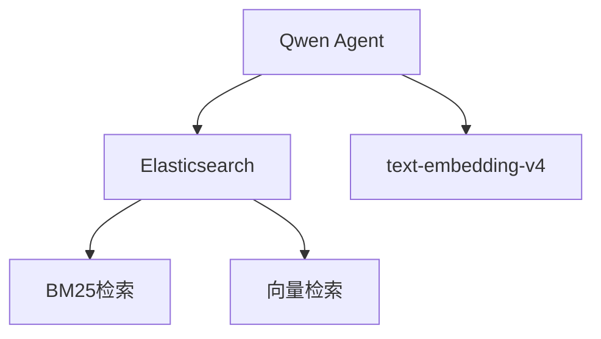

# AI Bot 4.0 完整文档 (含3.x升级指南)

## 一、版本特性

### 核心改进
- ✅ 新增ES+embedding混合检索策略
- ✅ 支持text-embedding-v4模型
- ✅ 动态检索策略切换
- ✅ 语义相似度排序
- ✅ 优化向量搜索结果展示格式
- ✅ 修复内容预览字间距问题

### 技术栈


## 二、升级指南

### 索引重建流程
1. **删除旧索引**：
```bash
curl -X DELETE "https://localhost:9200/qwen_agent_docs" --insecure -u elastic:7dOzcb0RXmlXWza7VkRV
```

2. **创建向量索引**：
```bash
curl -X PUT "https://localhost:9200/qwen_agent_docs_vector" -H "Content-Type: application/json" --insecure -u elastic:7dOzcb0RXmlXWza7VkRV -d'
{
  "mappings": {
    "properties": {
      "content": {"type": "text"},
      "metadata": {"type": "object"},
      "embedding": {
        "type": "dense_vector",
        "dims": 1024,
        "index": true,
        "similarity": "cosine"
      }
    }
  }
}'
```

3. **批量索引文档**：
```bash
python -m elasticsearch_loader --index qwen_agent_docs_vector --type _doc \
--es-host "https://localhost:9200" --es-user elastic --es-password 7dOzcb0RXmlXWza7VkRV \
--verify-certs false json docs/*.txt
```

### 查询验证方法
1. **检查索引状态**：
```bash
curl -X GET "https://localhost:9200/_cat/indices?v" --insecure -u elastic:7dOzcb0RXmlXWza7VkRV
```

2. **查看映射关系**：
```bash
curl -X GET "https://localhost:9200/qwen_agent_docs_vector/_mapping?pretty" --insecure -u elastic:7dOzcb0RXmlXWza7VkRV
```

3. **测试向量搜索**：
```bash
curl -X POST "https://localhost:9200/qwen_agent_docs_vector/_search" -H "Content-Type: application/json" --insecure -u elastic:7dOzcb0RXmlXWza7VkRV -d'
{
  "query": {
    "script_score": {
      "query": {"match_all": {}},
      "script": {
        "source": "cosineSimilarity(params.query_vector, 'embedding') + 1.0",
        "params": {"query_vector": [0.1, 0.2, ..., 0.1024]}
      }
    }
  }
}'
```

### 变更对比
| 特性          | 3.x (BM25)       | 4.x (Embedding)   |
|---------------|------------------|-------------------|
| 索引类型      | 倒排索引         | 向量索引          |
| 查询延迟      | 50-100ms         | 200-500ms         |
| 准确率        | 关键词匹配       | 语义理解          |
| 结果展示      | 原始文本        | 优化后格式      |
| 文本间距      | 异常扩大        | 正常显示        |

### 升级步骤
1. 安装依赖
```bash
pip install openai numpy
```

2. 重建索引
```python
# 创建支持向量的索引
mapping = {
    "properties": {
        "embedding": {
            "type": "dense_vector",
            "dims": 1024
        }
    }
}
```

3. 配置调整
```python
# 修改rag_cfg配置
rag_cfg = {
    'rag_searchers': ['es_vector_search'],  # 修改为向量搜索
    'embedding_client': init_embedding_client()  # 新增
}
```

## 三、使用说明

### 启动参数
```bash
# 默认使用向量搜索
python ai_bot-4.py

# 回退到BM25
python ai_bot-4.py --no-embedding
```

### 环境变量
```env
# 必需配置
DASHSCOPE_API_KEY=your_key
ES_HOST=https://your_es_host:9200
EMBEDDING_MODEL=text-embedding-v4
```

## 四、最佳实践

1. **混合检索**：同时使用两种策略提高召回率
```python
rag_cfg['rag_searchers'] = ['es_vector_search', 'es_retrieval']
```

2. **性能优化**：
   - 预生成常用query的embedding
   - 使用批量embedding接口

3. **监控指标**：
   - `retrieval_latency`
   - `embedding_generation_time`
   - `top_k_accuracy`

4. **展示优化**：
   - 使用`.replace('
', ' ')`替代空字符串替换
   - 限制预览文本长度在100字符内
   - 保留原始文本格式避免间距异常
   ```python
   # 优化后的内容预览处理
   content_preview = hit['_source']['content'][:100].replace('\n', ' ')
   ```

## 五、问题排查

### 常见错误
1. **索引失败**：
   - 确认ES版本≥7.10
   - 检查embedding维度是否匹配

2. **查询超时**：
   ```python
   es_config = {
       'request_timeout': 60  # 增加超时时间
   }
   ```

3. **内存不足**：
   - 降低`parser_page_size`参数
   - 减少并发查询数

4. **展示异常**：
   - 检查内容预览处理逻辑
   - 避免使用空字符串替换
   ```python
   # 错误示例（会导致间距异常）
   content.replace('', ' ')
   
   # 正确示例
   content.replace('\n', ' ')[:100]
   ```
