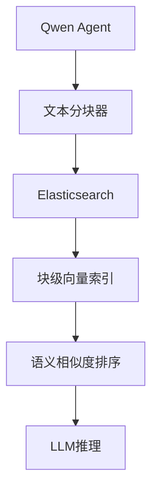

# AI Bot 5.0 完整文档 (含4.x升级指南)

## 一、版本特性

### 核心改进
- ✅ 引入文档分块技术，将长文档切分为小块
- ✅ 基于块级别的向量检索，而非整个文档
- ✅ 优化块大小为500字符，重叠50字符
- ✅ 增强文本分割算法，支持段落和句子级别分割
- ✅ 块级别元数据管理，包含块索引和总块数
- ✅ 改进检索结果展示，显示块ID和来源
- ✅ 支持环境变量配置块大小和重叠度

### 技术栈


## 二、升级指南

### 文档分块策略
1. **分块原理**：
   - 将长文档分割成固定大小的文本块
   - 相邻块之间保持一定重叠度，确保语义连贯性
   - 支持多级分割策略：段落 → 句子 → 字符

2. **块大小选择**：
   - 默认块大小：500字符
   - 默认重叠度：50字符
   - 可通过环境变量调整：`CHUNK_SIZE`和`CHUNK_OVERLAP`

3. **索引结构变更**：
```json
{
  "chunk_id": "filename_chunk_0",
  "content": "块内容...",
  "embedding": [0.1, 0.2, ...],
  "metadata": {
    "chunk_index": 0,
    "total_chunks": 10,
    "original_path": "path/to/file"
  }
}
```

### 索引重建流程
1. **创建支持块级索引**：
```bash
curl -X PUT "https://localhost:9200/qwen_agent_docs_vector" -H "Content-Type: application/json" --insecure -u elastic:password -d'
{
  "mappings": {
    "properties": {
      "content": {"type": "text"},
      "metadata": {"type": "object"},
      "embedding": {
        "type": "dense_vector",
        "dims": 1024,
        "index": true,
        "similarity": "cosine"
      },
      "chunk_id": {"type": "keyword"}
    }
  }
}'
```

2. **索引文档块**：
```python
# 文档分块并索引
text_splitter = TextSplitter(chunk_size=500, chunk_overlap=50)
chunks = text_splitter.split_text(document_content)

for i, chunk in enumerate(chunks):
    # 为每个块生成embedding
    embedding = get_embedding(client, chunk)
    
    # 索引块
    es.index(
        index="qwen_agent_docs_vector",
        body={
            "content": chunk,
            "embedding": embedding,
            "chunk_id": f"{filename}_chunk_{i}",
            "metadata": {
                "chunk_index": i,
                "total_chunks": len(chunks)
            }
        }
    )
```

### 变更对比
| 特性          | 4.x (文档级向量)   | 5.x (块级向量)     |
|---------------|-------------------|-------------------|
| 索引粒度      | 整个文档           | 500字符文本块      |
| 检索精度      | 文档级别匹配       | 段落/句子级别匹配  |
| 相关性        | 中等               | 高                |
| 索引大小      | 较小               | 较大              |
| 查询延迟      | 200-500ms          | 300-600ms         |
| 内存占用      | 中等               | 较高              |
| 结果展示      | 文档预览           | 块预览+块ID       |

## 三、核心组件

### TextSplitter 类
```python
class TextSplitter:
    """文本分块工具，将长文本分割成指定大小的块"""
    
    def __init__(self, chunk_size=500, chunk_overlap=50):
        self.chunk_size = chunk_size
        self.chunk_overlap = chunk_overlap
    
    def split_text(self, text):
        # 分块逻辑
        # 1. 按段落分割
        # 2. 处理过长段落，按句子分割
        # 3. 处理块重叠
        # ...
```

### 向量搜索工具增强
```python
@register_tool('es_vector_search')
class ESVectorSearch(BaseTool):
    # ...
    
    def index_documents(self, documents):
        """索引文档到Elasticsearch
        
        - 将文档分割成chunks
        - 为每个chunk生成embedding
        - 批量索引到Elasticsearch
        """
        
    def call(self, params: dict, **kwargs) -> list:
        """执行向量搜索
        
        - 生成查询embedding
        - 执行向量相似度搜索
        - 返回相关的文档块
        """
```

## 四、使用说明

### 环境变量配置
```env
# 必需配置
DASHSCOPE_API_KEY=your_key
ES_HOST=https://your_es_host:9200
ES_USER=elastic
ES_PASSWORD=your_password

# 可选配置
CHUNK_SIZE=500           # 文本块大小
CHUNK_OVERLAP=50         # 块重叠度
ES_INDEX_NAME=qwen_agent_docs_vector  # 索引名称
DOCS_DIR=docs            # 文档目录
```

### 启动参数
```bash
# 默认使用块级向量搜索
python ai_bot-5.py
```

## 五、最佳实践

### 1. 块大小优化
- **短文本文档**：使用较小的块大小（300-500字符）
- **长篇技术文档**：使用中等块大小（500-800字符）
- **结构化数据**：考虑按自然段落或章节分割

### 2. 检索策略
- **增加检索数量**：由于是块级检索，建议增加top_k值
```python
query_body = {
    # ...
    "size": 10,  # 增加检索数量，因为现在是chunk级别
}
```

### 3. 结果展示优化
```python
# 展示块ID和来源
print(f"块ID: {hit['_source'].get('chunk_id', 'unknown')}")
print(f"内容: {hit['_source']['content'][:100].replace('\n', ' ')}...")
print(f"来源: {hit['_source'].get('path', '')}")
```

### 4. 性能优化
- 批量生成embedding
- 使用bulk API批量索引
- 考虑块缓存策略

## 六、问题排查

### 常见错误
1. **分块不合理**：
   - 块太小：语义不完整
   - 块太大：检索精度下降
   - 解决：调整`CHUNK_SIZE`和`CHUNK_OVERLAP`

2. **索引性能问题**：
   ```python
   # 使用批量索引提高性能
   from elasticsearch.helpers import bulk
   success, _ = bulk(es, actions)
   ```

3. **内存占用过高**：
   - 减少并发处理的文档数
   - 分批处理大型文档集合

4. **检索结果不相关**：
   - 检查embedding质量
   - 调整相似度计算方法
   - 考虑混合检索策略

## 七、升级步骤

1. **安装依赖**
```bash
pip install openai numpy elasticsearch
```

2. **更新索引映射**
```python
# 确保索引包含chunk_id字段
es.indices.put_mapping(
    index=index_name,
    body={
        "properties": {
            "chunk_id": {"type": "keyword"}
        }
    }
)
```

3. **重新索引文档**
```python
# 使用TextSplitter分割文档
text_splitter = TextSplitter(chunk_size=500, chunk_overlap=50)
es_vector = ESVectorSearch()
docs = parse_files_to_docs(files)
indexed_count = es_vector.index_documents(docs)
```

4. **更新检索逻辑**
```python
# 修改为块级检索
for i, hit in enumerate(result['hits']['hits']):
    chunk_id = hit['_source'].get('chunk_id', 'unknown')
    print(f"#{i+1} 评分: {score:.4f} | Chunk: {chunk_id}")
```

## 八、未来展望

1. **动态块大小**：根据文档类型自动调整块大小
2. **层次化索引**：同时保留文档级和块级索引
3. **跨块关联**：考虑块之间的语义关联
4. **自适应重叠度**：根据文本特性动态调整重叠度
5. **多模态块**：支持文本+图像的混合块索引