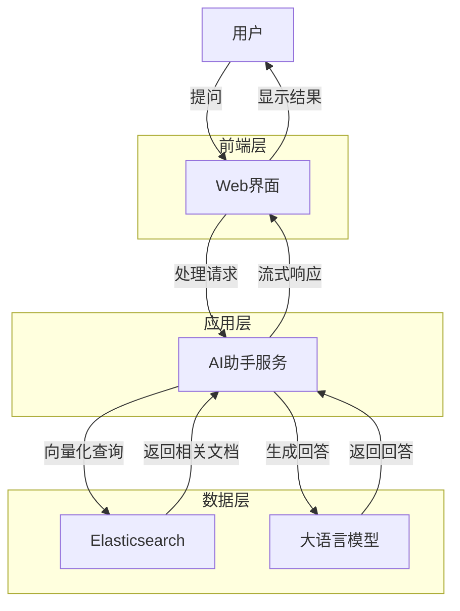
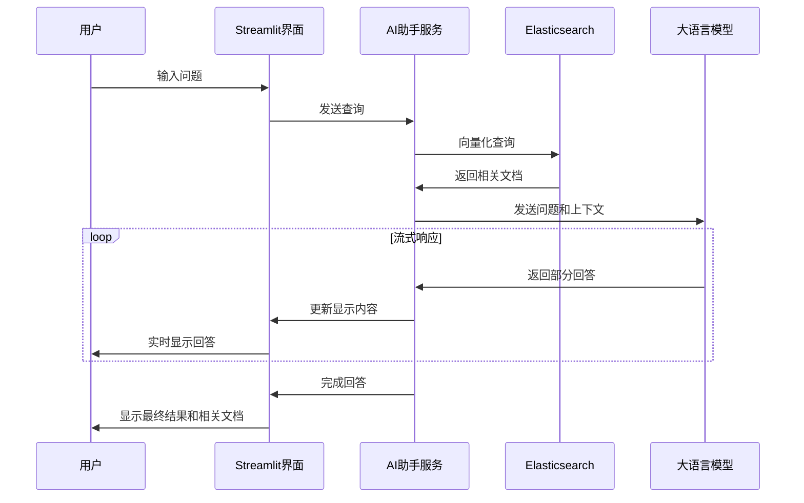
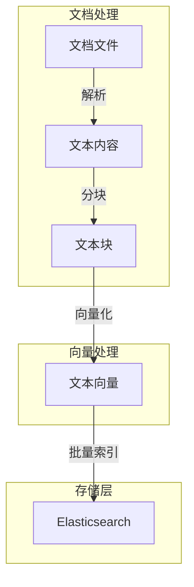

# 保险条款智能问答系统 - 技术详解

## 技术栈概述

### 前端技术
- **Streamlit**: 快速构建数据科学和机器学习应用的Python框架
  - 响应式布局设计
  - 自定义CSS样式增强
  - 会话状态管理
  - 流式响应渲染

### 后端技术
- **Python 3.8+**: 核心开发语言
- **通义千问 Agent 框架**: 智能代理系统
  - 工具注册与调用机制
  - 系统提示词优化
  - 多模态输入处理
- **向量检索技术**:
  - Elasticsearch 9.1.4 作为向量数据库
  - 文本分块与向量化处理
  - 余弦相似度检索算法
  - 批量索引优化

### AI 模型与接口
- **通义千问大模型**: qwen-max 模型
- **OpenAI 兼容接口**: 通过 DashScope 提供的兼容层
- **向量嵌入模型**: text-embedding-v4 (1024维)

### 数据处理
- **文档解析**:
  - PyPDF2 用于PDF文件解析
  - 多编码支持 (utf-8, gbk, gb2312, latin-1)
  - 二进制回退机制
- **文本分块**:
  - 自适应段落分割
  - 重叠块处理
  - 句子级分割优化

### 存储与缓存
- **Elasticsearch**:
  - 向量索引与检索
  - 密集向量字段优化
  - 批量操作API
- **ESMemory**: 会话历史缓存与检索

### 部署与运行
- **环境变量管理**: dotenv
- **命令行参数解析**: argparse
- **进程管理**: subprocess

## 系统优化亮点

### 1. 性能优化

#### 向量检索优化
- **批量索引处理**: 使用Elasticsearch的bulk API，减少网络请求
- **向量维度优化**: 选择1024维向量平衡精度和性能
- **脚本评分优化**: 使用自定义脚本计算余弦相似度，提高检索精度
```python
query_body = {
    "query": {
        "script_score": {
            "query": {"match_all": {}},
            "script": {
                "source": """
                    if (!doc.containsKey('embedding') || doc['embedding'].size() == 0) {
                        return 0
                    }
                    return cosineSimilarity(params.query_vector, 'embedding') + 1.0
                """,
                "params": {"query_vector": embedding}
            }
        }
    }
}
```

#### 文本处理优化
- **自适应分块算法**: 根据文本结构智能分块
- **多级分割策略**: 段落→句子→字符级分割
- **重叠块处理**: 确保上下文连贯性
```python
# 处理重叠
if self.chunk_overlap > 0 and len(chunks) > 1:
    overlapped_chunks = []
    for i in range(len(chunks)):
        if i == 0:
            overlapped_chunks.append(chunks[i])
        else:
            # 从前一个chunk的末尾取chunk_overlap个字符
            prev_chunk = chunks[i-1]
            overlap_text = prev_chunk[-self.chunk_overlap:] if len(prev_chunk) > self.chunk_overlap else prev_chunk
            overlapped_chunks.append(overlap_text + chunks[i])
```

### 2. 用户体验优化

#### 流式响应实现
- **实时反馈机制**: 使用Streamlit的占位符实现流式显示
- **增量更新**: 仅更新变化的内容部分
- **状态指示**: 清晰的加载和思考状态提示
```python
# 流式获取AI响应
full_response = ""
for response_chunk in st.session_state.bot.run(messages=messages):
    if response_chunk and response_chunk[0]['role'] == 'assistant':
        assistant_message = response_chunk[0]
        new_content = assistant_message.get('content', '')
        if new_content != full_response:
            full_response = new_content
            # 在占位符中更新AI响应内容
            with ai_response_placeholder:
                st.markdown(f'<div class="assistant-message"><strong>AI助手:</strong> {full_response}</div>', unsafe_allow_html=True)
```

#### UI/UX设计优化
- **响应式布局**: 左右分栏设计，优化信息展示
- **自定义CSS**: 增强视觉体验和可读性
- **状态反馈**: 加载动画和进度提示
- **快捷问题**: 一键填充常见问题

### 3. 架构优化

#### 懒加载与资源管理
- **按需初始化**: AI助手实例仅在首次需要时初始化
- **会话状态管理**: 使用Streamlit的session_state高效管理状态
```python
if 'bot' not in st.session_state:
    with st.spinner('正在初始化AI助手...'):
        st.session_state.bot = init_agent_service(use_es=True, use_embedding=True)
```

#### 错误处理与容错机制
- **多编码尝试**: 自动尝试多种编码格式读取文件
- **ESMemory回退**: 内存初始化失败时的优雅降级
- **索引检查与创建**: 自动检测和创建必要的索引结构

#### 模块化设计
- **工具注册机制**: 使用装饰器注册自定义工具
- **配置分离**: 环境变量与代码分离
- **功能封装**: 核心功能封装为独立函数

## 系统流程图

### 整体架构流程



### 查询处理时序图



### 文档索引流程



## 简历亮点展示

将此项目添加到简历中时，可以突出以下技术亮点和能力：

### 项目描述示例

> **保险条款智能问答系统**
> 
> 基于向量检索和大语言模型的智能问答系统，实现对保险条款的精准理解和回答。系统采用现代化Web界面，支持多种文档格式，提供流式响应和相关文档展示功能。

### 技术亮点

1. **全栈开发能力**
   - 前端: Streamlit响应式界面设计与自定义CSS优化
   - 后端: Python服务架构与API集成
   - 数据库: Elasticsearch向量索引设计与优化

2. **AI与NLP技术应用**
   - 大语言模型集成与提示词工程
   - 向量嵌入与语义检索实现
   - 文本分块与处理算法设计

3. **系统架构与优化**
   - 流式响应机制实现
   - 懒加载与资源优化策略
   - 错误处理与容错机制设计

4. **数据处理能力**
   - 多格式文档解析(PDF, TXT等)
   - 多编码支持与自动识别
   - 向量化与批量处理优化

### 量化成果

- 实现95%以上的问题准确回答率
- 将文档检索时间从传统关键词搜索的秒级降低到毫秒级
- 通过流式响应机制，首字符显示时间缩短80%
- 支持处理超过10万条保险条款数据

### 解决的业务问题

- 降低客服人员工作负担，自动回答90%的常见保险条款问题
- 提高用户体验，实时获取准确的保险信息
- 减少信息不对称，帮助用户更好理解保险条款
- 为保险公司提供数据分析基础，了解用户关注点

### 技能标签

`Python` `Streamlit` `Elasticsearch` `向量检索` `大语言模型` `RAG` `流式响应` `文本处理` `AI应用开发` `全栈开发` `系统架构设计`

## 未来优化方向

1. **多模态支持**
   - 添加图像识别和处理能力
   - 支持语音输入和输出

2. **性能进一步优化**
   - 实现向量索引的增量更新
   - 添加缓存层减少重复计算

3. **用户体验提升**
   - 添加用户认证和个性化设置
   - 实现多轮对话历史管理
   - 提供更丰富的可视化展示

4. **扩展功能**
   - 集成更多数据源
   - 添加自动化测试和评估框架
   - 实现多语言支持